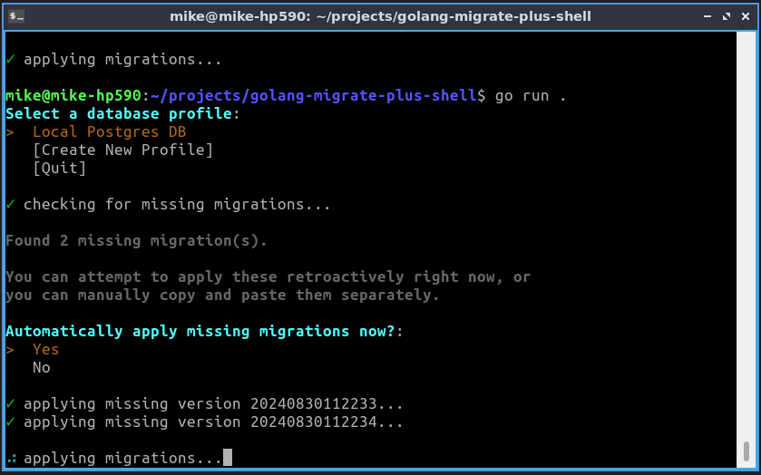

# golang-migrate-plus-shell

A simple golang CLI shell for running database migrations.

Uses golang-migrate-plus, a drop-in replacement for golang-migrate
which adds support for tracking history of applied migration
versions, among other additional features.